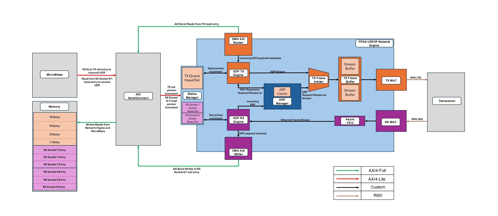
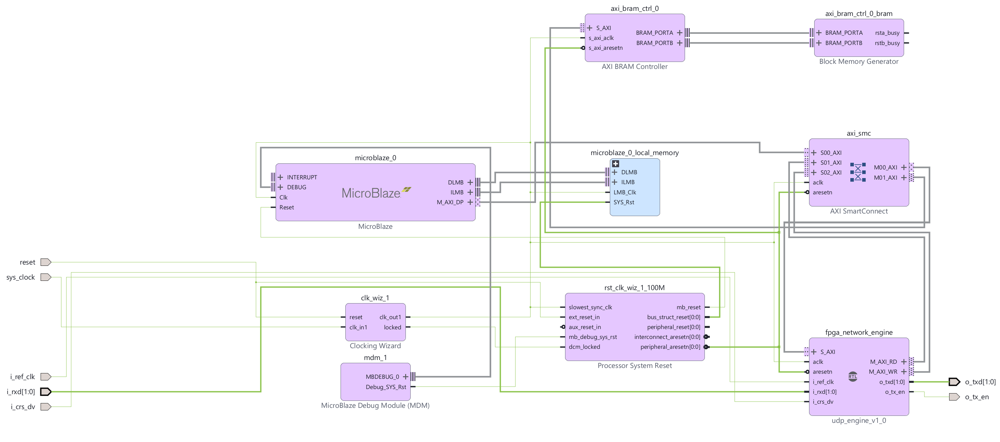

# FPGA IPv4/UDP Network Engine

This project is a hardware IPv4/UDP network engine intended for FPGA designs using an RMII Ethernet PHY. Software provides UDP payloads and packet metadata, which are received by the IPv4/UDP Network Engine. The hardware handles next-hop MAC resolution (including generating ARP requests if needed), IPv4/UDP header generation, Ethernet framing, and transmission.

A shared memory region exists between the processor and the IPv4/UDP Network Engine. This shared memory region contains a TX circular queue, as well as two RX circular queues (one for each local socket). More information on the shared memory region/circular queue functionality is described in 'Hardware/Software Queue Model'.

The receive path of the IPv4/UDP Network Engine checks and parses incoming Ethernet frames. Valid UDP payloads are written into socket-specific RX queues, and software is notified by incrementing the RX queue's tail register.

## High Level Architecture



The AXI4-Lite status manager holds the configuration registers and TX/RX queue pointers. 

Packet data is stored in a shared memory region between the processor and the IPv4/UDP Network Engine. The network engine accesses this shared memory region using custom AXI DMA write/read engines. 

On transmit, the UDP TX engine reads a queued descriptor, resolves the next-hop MAC address through the ARP manager, and submits the IPv4/UDP stream to the TX frame arbiter. ARP and UDP frames share the same dual-clock TX buffer and RMII MAC.

On receive, the RMII MAC removes the preamble and FCS and pushes the Ethernet frame into an asynchronous FIFO. The UDP RX engine then parses ARP, IPv4, and UDP traffic. Valid UDP payloads are written to the appropriate RX queue based on the destination UDP port.

## Features

- 100 Mb/s RMII interface operating from a 50 MHz PHY reference clock
- AXI4-Lite control/status interface
- Independent AXI4 read and write masters
- Automatic ARP request and reply generation
- Four-entry ARP cache with round-robin replacement
- IPv4 header checksum generation and verification
- Two hardware-bound UDP receive sockets
- Three DMA entries per receive socket
- Shared four-entry transmit queue
- UDP payloads from 0 to 1472 bytes
- Subnet-aware next-hop selection with optional default gateway
- Two complete-frame TX banks between the AXI and RMII clock domains
- Ethernet preamble, padding, FCS, and interpacket-gap generation

## YouTube Demo

Coming soon

## Hardware/Software Queue Model

Software owns the RX head pointers and TX tail pointer. Hardware owns the RX tail pointers and TX head pointer.

For transmit, software fills the current TX tail entry and advances `TX_TAIL`. The engine processes descriptors in order and advances `TX_HEAD` after the frame has been buffered or intentionally dropped.

For receive, hardware writes a complete packet into the current socket tail entry. The new entry is published only after the frame is valid and all AXI writes have completed successfully. Software consumes the entry and advances the corresponding RX head.

The DMA region occupies 15,000 bytes:

| Region | Entries | Offset from DMA base |
| --- | ---: | ---: |
| RX socket 0 | 3 | 0, 1500, 3000 |
| RX socket 1 | 3 | 4500, 6000, 7500 |
| TX | 4 | 9000, 10500, 12000, 13500 |

Each entry is 1500 bytes. The first 16 bytes contain metadata, followed by up to 1472 bytes of UDP payload.


## MicroBlaze Software

The driver in [`sw/microblaze`](sw/microblaze) exposes a small polling-based API:

```c
int udp_init(const udp_config_t *config);
udp_socket_t udp_socket_open(uint16_t local_port);
int udp_socket_close(udp_socket_t socket);

int udp_send(udp_socket_t socket,
             const void *payload,
             uint16_t payload_length,
             uint32_t destination_ip,
             uint16_t destination_port);

int udp_recv(udp_socket_t socket,
             void *payload,
             uint16_t payload_capacity,
             udp_info_t *info);
```

`udp_send()` returns after publishing the descriptor. ARP resolution and frame transmission continue in hardware. Likewise, `udp_recv()` polls until a packet is available for the selected socket.

See [`sw/microblaze/main.c`](sw/microblaze/main.c) for a minimal transmit example. The MMIO base, packet RAM base, local network configuration, and remote IP should be updated to match the Vivado address map and the connected PC.

If the MicroBlaze data cache is enabled, the DMA packet region must either be uncached or the cache maintenance hooks in `udp_api.c` must be connected to the BSP cache functions.

## Vivado Integration



The top-level entity is [`src/udp_engine.vhd`](src/udp_engine.vhd). A typical design connects:

- `S_AXI_*` to the processor interconnect for configuration and queue pointers
- `M_AXI_RD_*` and `M_AXI_WR_*` to the shared packet RAM
- `i_ref_clk`, `i_rxd`, `i_crs_dv`, `o_txd`, and `o_tx_en` to the RMII PHY
- `aclk` and `aresetn` to the AXI/protocol clock domain

The local MAC address is set with `G_LOCAL_MAC`. The local IPv4 address, subnet mask, gateway, DMA base address, and socket ports are configured at runtime through AXI4-Lite.

The RTL uses AMD/Xilinx XPM memories and asynchronous FIFOs, so the XPM library must be available during simulation and synthesis.

## Verification

The `sim` directory contains:

- `tb_udp_axi_reader.sv` for AXI burst splitting, 4 KiB boundary handling, and reader buffering
- `tb_udp_engine.sv` for ARP miss/reply, UDP transmit, UDP receive, IPv4 checksum, and DMA traffic

The transmit and receive paths have also been tested on hardware and verified using a MicroBlaze application and a directly connected PC.

## Latency

All latency values in this section are reported in AXI/system clock cycles.

### Transmit Latency

The transmit latency measurement begins when the processor starts the AXI4-Lite transaction that updates `TX_TAIL` and ends when hardware increments `TX_HEAD` and returns the TX Engine to idle. Incrementing `TX_HEAD` also frees another TX queue entry, allowing software to push another packet for transmission.

Transmit latency depends on whether the ARP Manager already has the packet's next-hop IP-to-MAC mapping. On a cache miss, an ARP request must be transmitted and the reply must be received and decoded before UDP transmission can continue. This makes the total latency dependent on the network and the remote host's response time.

#### ARP Cache Hit

The ARP-cache-hit transmit latency assumes:

- A 100 MHz AXI/system clock
- AXI address requests are accepted immediately and the memory controller sustains one 32-bit read beat per cycle
- The TX Frame Arbiter is idle and at least one TX Stream Buffer is available
- The payload read fits within one AXI burst
- The payload length is nonzero
- The IPv4 destination address's next-hop MAC address is cached by the ARP Manager

| Operation | Latency |
| --- | ---: |
| AXI4-Lite TX tail update | 3 cycles |
| Detect the new TX queue entry | 1 cycle |
| Read, store, and validate the TX metadata | 8 cycles |
| Request and receive the cached next-hop MAC address | 3 cycles |
| Generate the IPv4 header checksum | 10 cycles |
| Buffer the IPv4/UDP header and payload | `11 + ceil(payload_bytes / 4)` cycles |
| Release the TX entry, increment `TX_HEAD`, and return to idle | 1 cycle |

L<sub>total</sub> = `37 + ceil(payload_bytes / 4)` cycles

At 100 MHz, one AXI/system clock cycle is 10 ns:

t<sub>total</sub> = `370 ns + 10 ns * ceil(payload_bytes / 4)`

A zero-length payload skips the payload-read states and takes 34 cycles, or 340 ns at 100 MHz.

The AXI reader splits payload reads at 256-beat and 4 KiB boundaries. Under the same assumptions, each additional payload burst adds at least one AXI/system clock cycle.

Once software begins the AXI4-Lite transaction that updates `TX_TAIL`, it takes L<sub>total</sub> cycles for hardware to increment `TX_HEAD` and prepare the TX Engine to handle another packet.

### Receive Latency

Coming soon

## Resources and Timing

### Resource Utilization

The IPv4/UDP Network Engine was synthesized with Vivado 2026.1 for the Basys 3 FPGA development board.

The resource utilization based on synthesis results is as follows:

| Resource | Utilization |
| --- | ---: |
| LUTs | 2,672 |
| Flip-flops | 2,858 |
| Block RAM | 1 x 36 Kib + 2 x 18 Kib (9 KiB total) |

### Timing

The IPv4/UDP Network Engine was implemented with Vivado 2026.1 for the Basys 3.

The Basys 3 does not include an onboard Ethernet PHY. For hardware testing, I connected a LAN8720 RMII PHY module to the Pmod headers with one-inch jumper wires. This is not recommended for a final design because signal integrity is not guaranteed. The RMII pin assignments and PHY timing constraints are in [`constraints/basys3.xdc`](constraints/basys3.xdc).

After implementation, the timing results were:

| Timing check | Slack |
| --- | ---: |
| Worst negative slack (WNS) | +0.402 ns |
| Worst hold slack (WHS) | +0.022 ns |

Both values are positive, so the design met setup and hold timing for the constrained paths.

## Current Limitations

- IPv4 and Ethernet II only
- No VLAN support
- No IPv4 options, fragmentation, or reassembly
- No DHCP, ICMP, TCP, or multicast
- UDP checksum is transmitted as zero and is not verified on receive
- One outstanding ARP resolution at a time
- Two receive sockets and one in-order transmit queue

## Repository Layout

```text
src/              VHDL RTL
sim/              SystemVerilog testbenches
sw/microblaze/    MicroBlaze UDP API and example application
sw/pc/            PC-side UDP test script
```
